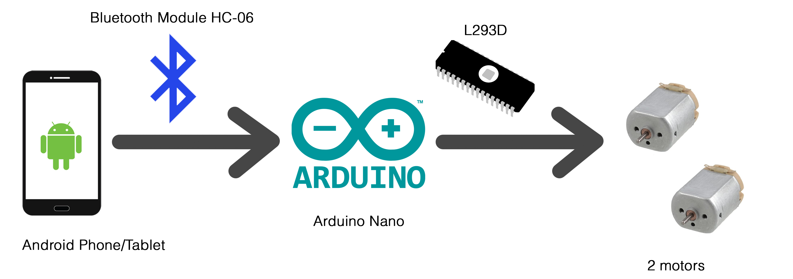
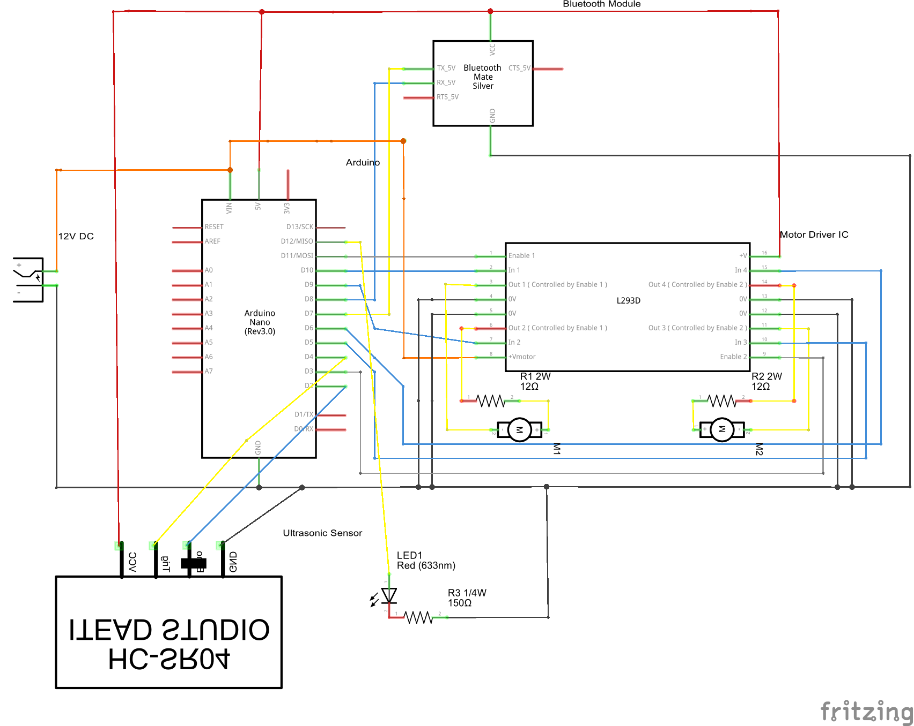

# R-03: Bluetooth Car
+ Front view

+ Rear view

## Overview
Car model that can be controlled by Android phone/tablet through bluetooth.

\* Android app to control car: [Arduino Bluetooth RC Car](https://play.google.com/store/apps/details?id=braulio.calle.bluetoothRCcontroller&hl=en) by Andi.Co.

## How it works

Android phone/tablet connects to __Arduino Nano__ with the help of __Bluetooth
Module HC-06 (Slave)__. Then Arduino control motors able to foward and backward
with the help of __"dual H-bridge" IC L293D__.

\* __LED 10mm__ is adding part that lights up showing the circuit is ready to work.

\* __Ultrasonic Sensor HC-SR04__ for preventing accident when going too close to
object like wall (you can't go foward if too-close).

## Schematic

## Code
Just use Arduino IDE upload __R-03_BluetoothCar.ino__ to your car's arduino.
